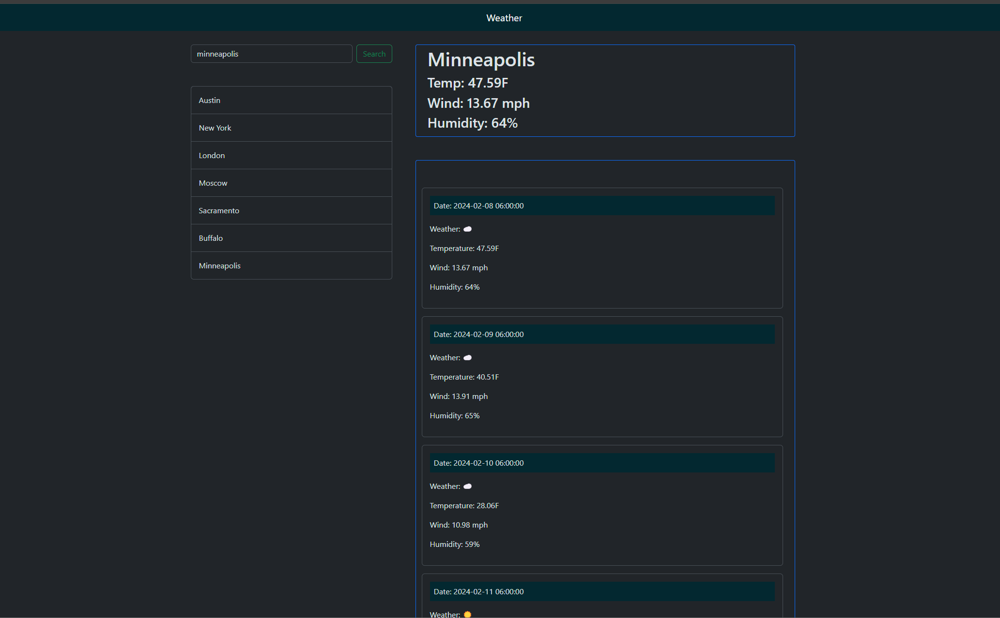

# weather-app

## Description

This is a simple webpage to show the weather for a searched city. It includes current weather, and a 5-day forecast.

## Table of Contents

- [Features](#features)
- [Usage](#usage)
- [License](#license)
- [Contributing](#contributing)
- [Author](#author)
- [Acknowledgments](#acknowledgments)

## Features

- Takes a user search
- Displays current weather
- Displays cards for 5 day forecast

## Installation & Usage

1. Navigate to [Here](https://vader9911.github.io/weather-app/)
2. Enter a city search.
3. Get weather data

## License

This project is licensed under the MIT License - see the [LICENSE](LICENSE) file for details.

## Contributing

Feel free to contribute to this project by opening issues or submitting pull requests.

## Author

Jeffrey Scott

If you have any questions or need further assistance, feel free to [contact me on GitHub](https://github.com/vader9911).

## Acknowledgments

- [MDN](https://developer.mozilla.org/en-US/) - Resources for Developers, by Developers.
